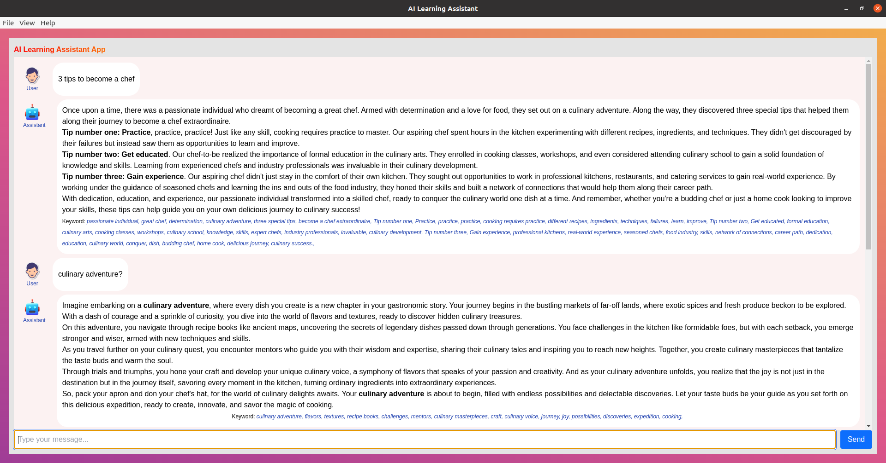

# Electron React App with Tailwind CSS and TypeScript

This project is an Electron application built using React and TypeScript, styled with Tailwind CSS. It also integrates with the OpenAI API for AI functionalities.



## Table of Contents

- [Electron React App with Tailwind CSS and TypeScript](#electron-react-app-with-tailwind-css-and-typescript)
  - [Table of Contents](#table-of-contents)
  - [Features](#features)
  - [Prerequisites](#prerequisites)
  - [Installation](#installation)

## Features

- **Electron** for building cross-platform desktop applications.
- **React** for building the user interface.
- **TypeScript** for static typing.
- **Tailwind CSS** for utility-first CSS styling.
- Integration with **OpenAI API** for AI functionalities.

## Prerequisites

- Node.js (v14 or later)
- npm (v6 or later) or yarn (v1.22 or later)

## Installation

1. Clone the repository:

   ```sh
   git clone https://github.com/yourusername/electron-react-app.git
   cd electron-react-app

